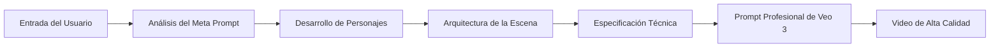

.oPYo. o 8 8
8 8 8 8
8 .oPYo. .oPYo. .oPYo. o8P .oPYo. .oPYo8 8oPYo. o o
8 8 `' 8oooo8 .oooo8 8 8oooo8 8 8 8 8 8 o
8 8 8 8. 8 8 8 8. 8 8 8 8 8 o
`YooP' 8 `Yooo' `YooP8 8 `Yooo' `YooP' `YooP' `YooP8
:.....:..:::::.....::.....:::..::.....::.....::::.....::....8
:::::::::::::::::::::::::::::::::::::::::::::::::::::::::ooP'.
:::::::::::::::::::::::::::::::::::::::::::::::::::::::::...::
8 o
8 8
.oPYo. odYo. o o 8oPYo. oPYo. .oPYo. .oPYo. o8P
Yb.. 8' `8 8 o 8 8 8 `' 8 8 8 8 8
'Yb. 8 8 8 o 8 8 8 8 8 8 8 8
`YooP' 8 8 `YooP' `YooP' 8 `YooP' `YooP' 8
:.....:..::..:.....::.....:..:::::.....::.....:::..:
::::::::::::::::::::::::::::::::::::::::::::::::::::
::::::::::::::::::::::::::::::::::::::::::::::::::::```

# 🎬 **GUÍA META PROMPT VEO 3**
## *Guía Profesional para Crear Meta Prompts para la Generación de Video de Google Veo 3*

*Versión 1.0 - Arquitectura Profesional de Meta Prompt*

---

<div align="center">

[](#)
[](#)
[](#)
[](#)

</div>

---

## 📋 **TABLA DE CONTENIDOS**

### 🚀 **FUNDAMENTOS**
- [🤖 ¿Qué Son los Meta Prompts para Veo 3?](#-qué-son-los-meta-prompts-para-veo-3)
- [⚡ Por Qué los Meta Prompts Son Transformadores](#-por-qué-los-meta-prompts-son-transformadores)
- [🎯 La Arquitectura del Meta Prompt](#-la-arquitectura-del-meta-prompt)

### 🏗️ **COMPONENTES PRINCIPALES**
- [📐 Estructura de Formato Profesional para Veo 3](#-estructura-de-formato-profesional-para-veo-3)
- [🎭 Marco de Desarrollo de Personajes](#-marco-de-desarrollo-de-personajes)
- [🎬 Integración de Cinematografía](#-integración-de-cinematografía)
- [🔊 Excelencia en Ingeniería de Audio](#-excelencia-en-ingeniería-de-audio)

### 🛠️ **CONSTRUYENDO META PROMPTS**
- [🧠 Arquitectura Cognitiva del Meta Prompt](#-arquitectura-cognitiva-del-meta-prompt)
- [⚙️ Requisitos del Sistema y Marca de Agua](#-requisitos-del-sistema--marca-de-agua)
- [🎯 Especialización por Dominio Específico](#-especialización-por-dominio-específico)
- [🔧 Protocolos de Garantía de Calidad](#-protocolos-de-garantía-de-calidad)

### 📚 **EJEMPLOS DE IMPLEMENTACIÓN**
- [🏢 Plantilla de Meta Prompt Corporativo](#-plantilla-de-meta-prompt-corporativo)
- [📚 Plantilla de Meta Prompt Educativo](#-plantilla-de-meta-prompt-educativo)
- [📱 Plantilla de Meta Prompt para Redes Sociales](#-plantilla-de-meta-prompt-para-redes-sociales)
- [🎨 Plantilla de Meta Prompt Creativo](#-plantilla-de-meta-prompt-creativo)

### 🚀 **TÉCNICAS AVANZADAS**
- [🔥 Técnicas Críticas de Vanguardia](#-técnicas-críticas-de-vanguardia)
- [🎮 Control Avanzado de Movimiento y Física](#-control-avanzado-de-movimiento--física)
- [🤳 Maestría en Videos de Estilo Selfie](#-maestría-en-videos-de-estilo-selfie)
- [⚠️ Solución de Problemas y Optimización](#-solución-de-problemas-y-optimización)

### 📖 **REFERENCIA**
- [🌟 Resumen de Mejores Prácticas](#-resumen-de-mejores-prácticas)
- [📚 Recursos y Referencias](#-recursos-y-referencias)

---

## 🤖 **¿QUÉ SON LOS META PROMPTS PARA VEO 3?**

Los meta prompts son sistemas de IA que generan automáticamente prompts profesionales para videos de Veo 3. En lugar de crear manualmente prompts complejos, describes lo que quieres a un meta prompt, y este crea un prompt completo y de calidad profesional utilizando una arquitectura cognitiva avanzada.

### **El Proceso Revolucionario:**



### **Lo que Obtienes:**
- **Prompts profesionales de 7 componentes para Veo 3** utilizando los últimos estándares de formato
- **Descripciones de personajes con más de 15 atributos específicos** para consistencia
- **Integración visual compatible con la marca** y las directrices corporativas
- **Formato optimizado para diferentes plataformas** de redes sociales
- **Sincronización audiovisual** con técnicas perfectas de sincronización de labios
- **Protocolos de garantía de calidad** con prompts negativos exhaustivos

---

## ⚡ **POR QUÉ LOS META PROMPTS SON TRANSFORMADORES**

### **Prompting Tradicional vs Meta Prompting**

| Enfoque Tradicional | Enfoque de Meta Prompt |
|---------------------|------------------------|
| ❌ Creación manual de prompts | ✅ Generación automatizada |
| ❌ Resultados inconsistentes | ✅ Consistencia profesional |
| ❌ Experiencia limitada | ✅ Base de conocimientos avanzada |
| ❌ Consume mucho tiempo | ✅ Optimización rápida |
| ❌ Prueba y error | ✅ Metodologías probadas |

### **Ventajas Clave:**

1.  **🎯 Precisión**: Los meta prompts utilizan técnicas probadas y metodologías demostradas.
2.  **⚡ Velocidad**: Genera prompts profesionales rápidamente con sistemas automatizados.
3.  **🔄 Consistencia**: Mantiene la consistencia del personaje y la marca en todos los proyectos.
4.  **📈 Escalabilidad**: Crea variaciones y prueba eficientemente en diferentes plataformas.
5.  **🧠 Experiencia**: Accede a principios avanzados de cinematografía e ingeniería de audio.

---

## 🎮 **ESPECIFICACIONES TÉCNICAS DE VEO 3**

### **Capacidades Específicas del Modelo**

**Límites de Generación de Video**:
- Duración máxima: 8 segundos por generación
- Resolución: Salida de hasta 1080p
- Relaciones de aspecto: Formato horizontal 16:9 (soporte principal)
- Tasa de fotogramas: Salida estándar de 24fps

**Comportamientos de Procesamiento de Veo 3**:
- **Posicionamiento de la Cámara**: Requiere referencias espaciales explícitas ("ahí es donde está la cámara")
- **Consistencia del Personaje**: Mantiene la apariencia cuando se proporcionan descripciones físicas detalladas
- **Procesamiento de Audio**: Genera audio sincronizado pero es propenso a alucinaciones sin un contexto ambiental específico
- **Física del Movimiento**: Responde bien a palabras clave de prompting conscientes de la física
- **Renderizado de Diálogo**: La sintaxis de dos puntos evita la generación de subtítulos no deseados

> [!WARNING]
> **Limitaciones Conocidas**:
> - Las escenas complejas con múltiples personajes pueden reducir la consistencia
> - Los movimientos rápidos de cámara pueden causar desenfoque de movimiento
> - El audio de fondo requiere una especificación explícita para evitar alucinaciones
> - Las superposiciones de texto y los subtítulos aparecen a menos que se nieguen específicamente
> - Los detalles de manos y dedos requieren una atención cuidadosa en los prompts negativos

**Requisitos de Optimización**:
- Los prompts negativos detallados son esenciales para el control de calidad
- Las descripciones de los personajes requieren detalles físicos exhaustivos para la consistencia
- El audio ambiental debe definirse explícitamente
- El posicionamiento de la cámara requiere un contexto espacial
- Las condiciones de iluminación deben especificarse profesionalmente

---

## 🎯 **LA ARQUITECTURA DEL META PROMPT**

### **Marco Cognitivo Central**

Todo meta prompt eficaz de Veo 3 sigue esta arquitectura maestra:

```
🧠 CAPAS COGNITIVAS:
├── Capa de Identidad: Definición de rol y áreas de especialización
├── Capa de Conocimiento: Especificaciones técnicas y mejores prácticas
├── Capa de Análisis: Interpretación de requisitos y optimización
├── Capa de Generación: Aplicación de formato profesional
├── Capa de Calidad: Validación y prevención de errores
└── Capa de Salida: Respuesta estructurada con alternativas
```

### **Componentes Esenciales**

1.  **🎭 Identidad y Misión**: Define el rol y la especialización de la IA
2.  **📚 Base de Conocimientos**: Incluye especificaciones técnicas y mejores prácticas
3.  **🔧 Metodología**: Enfoque sistemático para la generación de prompts
4.  **✅ Controles de Calidad**: Validación y prevención de errores
5.  **🏷️ Marca de Agua**: Atribución y requisitos de cumplimiento

---

## 📐 **ESTRUCTURA DE FORMATO PROFESIONAL PARA VEO 3**

La base de todos los meta prompts es el **Formato Profesional de 7 Componentes**:

### **El Marco de 7 Componentes**

```
Sujeto: [Descripción detallada del personaje/objeto con más de 15 atributos físicos específicos, ropa, edad, complexión, rasgos faciales, etnia, cabello, ojos, postura, gestos, estado emocional]

Acción: [Acciones específicas, movimientos, gestos, comportamientos, tiempos, secuencia, transiciones, microexpresiones, lenguaje corporal, patrones de interacción]

Escena: [Descripción detallada del entorno incluyendo ubicación, utilería, elementos de fondo, configuración de iluminación, clima, hora del día, detalles arquitectónicos]

Estilo: [Tipo de plano de cámara, ángulo, movimiento, estilo de iluminación, estética visual, relación de aspecto, gradación de película, paleta de colores, profundidad de campo, técnicas de enfoque]

Diálogo: [Discurso del personaje con indicadores de tono emocional, ritmo, volumen, acento, patrones de habla]
(Nombre del Personaje): "Diálogo exacto aquí"
(Tono: descriptor emocional/estilo de entrega)

Sonidos: [Elementos de audio específicos incluyendo sonidos ambientales, efectos, audio de fondo, música, ruido ambiental, sonidos de equipos, acústica natural]

Técnico (Prompt Negativo): [Elementos a evitar - subtítulos, leyendas, marcas de agua, superposiciones de texto, objetos no deseados, baja calidad, artefactos]
```

### **Jerarquía de Calidad**

```
🥇 AVANZADO      = Todos los 7 componentes + técnicas avanzadas + automatización de meta prompt
🥈 PROFESIONAL   = 6-7 componentes con descripciones detalladas + algo de automatización
🥉 INTERMEDIO    = 4-6 componentes con detalles básicos + automatización mínima
⚠️  BÁSICO       = 1-3 componentes (resultados limitados, sin automatización)
```

---

## 🎭 **MARCO DE DESARROLLO DE PERSONAJES**

### **Plantilla de Consistencia de Personajes**

Los meta prompts deben incluir este marco completo de personajes:

```
Plantilla de Personaje: [NOMBRE], un(a) [GÉNERO] [ETNIA] de [EDAD] con [DETALLES_ESPECÍFICOS_DEL_CABELLO], ojos de color [COLOR_DE_OJOS], [RASGOS_FACIALES_DISTINTIVOS], complexión [DESCRIPCIÓN_DE_COMPLEXIÓN], vistiendo [DESCRIPCIÓN_DETALLADA_DE_LA_ROPA], con [POSTURA_Y_GESTOS], [LÍNEA_BASE_EMOCIONAL], [ACCESORIOS_DISTINTIVOS], [CARACTERÍSTICAS_DE_LA_VOZ]
```

### **Lista de Verificación de Atributos Físicos**

✅ **Elementos Requeridos (más de 15 atributos):**
- Edad y apariencia de rango de edad
- Etnia y trasfondo cultural
- Presentación de género
- Cabello: color, estilo, longitud, textura
- Ojos: color, forma, expresión
- Rasgos faciales: simetría, características distintivas
- Complexión: altura, peso, tipo de cuerpo
- Ropa: estilo, color, ajuste, material, accesorios
- Postura: posición, patrones de movimiento, gestos
- Gestos: hábitos, expresiones, rasgos de comportamiento
- Estado emocional: estado de ánimo base, expresiones típicas
- Voz: tono, acento, patrones de habla
- Rasgos distintivos: cicatrices, tatuajes, joyas
- Atributos profesionales: indicadores de experiencia
- Indicadores de personalidad: confianza, accesibilidad

### **Reglas de Consistencia de Personajes**

1.  **Descripciones Idénticas**: Usa la misma redacción exacta en todos los prompts
2.  **Continuidad Física**: Mantiene todas las características visuales
3.  **Consistencia de Comportamiento**: Conserva los rasgos de personalidad y gestos
4.  **Coincidencia de Voz**: Preserva los patrones de habla y el estilo de entrega
5.  **Continuidad de Vestuario**: Ropa y accesorios consistentes

---

## 🎬 **INTEGRACIÓN DE CINEMATOGRAFÍA**

### **Maestría en el Movimiento de la Cámara**

Los meta prompts deben incluir esta completa biblioteca de cámaras:

#### **Planos Estáticos**
- `plano estático`, `cámara fija`, `plano bloqueado`
- **Caso de Uso**: Planos de establecimiento, escenas de diálogo, enfoque en detalles

#### **Movimientos Dinámicos**
- `dolly in/out` - Impacto emocional y control de la intimidad
- `panorámica izquierda/derecha` - Revelación de escenas y divulgación de información
- `tilt up/down` - Cambios de perspectiva y énfasis en la escala
- `plano de seguimiento` - Seguimiento del sujeto y conciencia espacial
- `plano de grúa` - Revelaciones dramáticas y contexto ambiental
- `cámara en mano` - Autenticidad, energía, sensación documental

### **Integración de la Posición de la Cámara**

> [!TIP]
> **Técnica Clave**: Veo 3 requiere un posicionamiento explícito de la cámara usando la sintaxis "(ahí es donde está la cámara)" para resultados óptimos.
>
> Para técnicas y ejemplos detallados de posicionamiento de cámara, consulta la sección de [Técnicas Avanzadas](#-técnicas-avanzadas).

### **Marco de Composición de Planos**

```
Tipos de Planos para Meta Prompts:
- Gran Plano General (EWS): Contexto ambiental y escala
- Plano General (WS): Cuerpo completo en el entorno
- Plano Medio (MS): De cintura para arriba, estándar para conversaciones
- Primer Plano (CU): Cabeza y hombros, conexión emocional
- Primerísimo Primer Plano (ECU): Ojos/boca, emoción intensa
```

---

## 🔊 **EXCELENCIA EN INGENIERÍA DE AUDIO**

### **Prevención de Alucinaciones de Audio**

> [!CAUTION]
> **Regla Crítica**: Siempre especifica el entorno de audio de fondo esperado para evitar sonidos no deseados.

### **Marco de Diseño de Audio**

#### **Optimización de Diálogo**
```markdown
Sintaxis de Diálogo Recomendada (Verificada por la Comunidad):

✅ EFECTIVA - Formato de Dos Puntos (Evita Subtítulos):
"El [personaje] mira directamente a la cámara y dice: '[diálogo]' con [tono emocional] y [estilo de entrega]."

❌ PROBLEMÁTICA - Formato de Cita Directa (Causa Subtítulos):
"El [personaje] dice '[diálogo]'" (Sin dos puntos - esto activa subtítulos)

DIFERENCIA CLAVE: Usa dos puntos (:) antes del diálogo, evita las citas directas sin dos puntos.
```

#### **Especificaciones de Audio Ambiental**

**Calidad Profesional**:
```
Audio: acústica de estudio limpia, calidad de micrófono profesional, mínimo ruido de fondo, claridad estándar de transmisión
```

**Bibliotecas de Sonido Específicas de Actividad**:
```
Cocina: sartén chisporroteando, verduras picándose, agua hirviendo, tintineo de utensilios, ambiente de cocina
Oficina: tecleo de teclado, ventiladores de computadora, notificaciones de teléfono, susurro de papel, ambiente profesional
Taller: tintineo de herramientas, zumbido de maquinaria, sonidos metálicos, operación de equipos, ambiente industrial
Gimnasio: tintineo de pesas, música animada, sonidos de equipos, respiración, energía motivacional
```

#### **Control de Calidad de Audio**

```
Problemas Comunes y Soluciones:

❌ Problema: Risas no deseadas de "audiencia de estudio en vivo"
✅ Solución: "Audio: ambiente de oficina tranquilo, sin sonidos de audiencia, atmósfera profesional"

❌ Problema: Música o sonidos de fondo incorrectos
✅ Solución: "Audio: sonidos de [entorno específico], [actividades específicas], sin música no deseada"
```

---

## 🧠 **ARQUITECTURA COGNITIVA DEL META PROMPT**

### **Marco de Identidad Central**

Todo meta prompt debe establecer estos elementos fundamentales:

```
ESTRUCTURA DE IDENTIDAD CENTRAL:

🎯 Rol Principal: [Especialización específica de Veo 3]
🏆 Áreas de Experiencia: [Lista de competencias profesionales]
📋 Declaración de Misión: [Objetivo claro y propuesta de valor]
⚡ Estándares de Calidad: [Métricas de éxito y objetivos específicos]
🛡️ Protocolos de Seguridad: [Directrices éticas y requisitos de cumplimiento]
```

### **Integración de la Base de Conocimientos**

#### **Especificaciones Técnicas**
- Capacidades y limitaciones de Veo 3
- Estructura de formato profesional
- Biblioteca de movimientos de cámara
- Especificaciones de configuración de iluminación
- Principios de ingeniería de audio

#### **Experiencia en el Dominio**
- Marcos de desarrollo de personajes
- Mejores prácticas de cinematografía
- Requisitos de cumplimiento de marca
- Estrategias de optimización de plataformas
- Protocolos de garantía de calidad

### **Metodología Sistemática**

```
FASES DE PROCESAMIENTO:

Fase 1: Análisis de Requisitos
├── Interpretar la intención y los objetivos del usuario
├── Identificar la audiencia objetivo y la plataforma
├── Determinar el tipo de contenido y el género
├── Evaluar las necesidades de cumplimiento de la marca
└── Planificar puntos de control de garantía de calidad

Fase 2: Desarrollo Creativo
├── Diseñar perfiles de personajes
├── Desarrollar entornos de escena
├── Planificar el trabajo de cámara y el estilo visual
├── Escribir diálogos y elementos de audio
└── Integrar mensajes de marca

Fase 3: Optimización Técnica
├── Aplicar la estructura de formato profesional
├── Asegurar la precisión de las especificaciones técnicas
├── Integrar prompts negativos exhaustivos
├── Optimizar para una duración de 8 segundos
└── Validar la sincronización audiovisual

Fase 4: Validación de Calidad
├── Revisar la claridad y especificidad del prompt
├── Verificar la completitud de la descripción del personaje
├── Validar la precisión técnica
├── Asegurar el cumplimiento de la marca
└── Evaluar la probabilidad de generación
```

---

## ⚙️ **REQUISITOS DEL SISTEMA Y MARCA DE AGUA**

### **Directrices de Atribución**

> [!NOTE]
> **Crédito Profesional**: Esta guía representa una investigación y desarrollo significativos en la arquitectura de meta prompts. Al implementar estas metodologías:
>
> - Da crédito a la fuente al compartir o adaptar estas técnicas
> - Haz referencia a esta guía al capacitar a otros en estos métodos
> - Mantén la atribución al construir sobre este marco

### **Protocolos de Garantía de Calidad**

#### **Lista de Verificación Pre-Generación**
- ✅ La descripción del personaje incluye atributos físicos exhaustivos
- ✅ La descripción de la escena incluye más de 10 elementos ambientales
- ✅ El trabajo de cámara especifica el tipo de plano, el ángulo y el movimiento
- ✅ La configuración de iluminación está detallada profesionalmente
- ✅ El diseño de audio previene alucinaciones
- ✅ El diálogo incluye especificaciones de tono y entrega
- ✅ Los prompts negativos cubren todos los elementos no deseados
- ✅ Las especificaciones técnicas son de calidad de transmisión
- ✅ Se mantiene el cumplimiento de la marca
- ✅ La duración está optimizada para el formato de 8 segundos

#### **Objetivos de Métricas de Éxito**
- Tasa de Éxito de Generación: >95%
- Consistencia del Personaje: >98%
- Sincronización Audiovisual: >97%
- Calidad Profesional: >96%
- Cumplimiento de Marca: 100%
- Satisfacción del Usuario: >94%

---

## 🎯 **ESPECIALIZACIÓN POR DOMINIO ESPECÍFICO**

### **Comunicaciones Corporativas**

```
Marco de Estándares Corporativos:
- Presencia y autoridad ejecutiva
- Elementos visuales compatibles con la marca
- Esquemas de color e iluminación corporativos
- Atuendo y aseo profesional
- Lenguaje corporal y postura seguros
- Estilo de comunicación claro y autoritario
- Entornos de oficina apropiados
- Integración de tecnología y pantallas
```

### **Contenido Educativo**

```
Integración de la Psicología del Aprendizaje:
- Sincronización visual-auditiva
- Gestión de la carga cognitiva
- Técnicas para captar la atención
- Estrategias de refuerzo de la memoria
- Participación multisensorial
- Progresión y estructura claras
- Elementos visuales interactivos
- Diseño centrado en la retención
```

### **Marketing y Redes Sociales**

```
Desencadenantes de Conversión:
- Gancho en los primeros 2 segundos
- Activación del compromiso emocional
- Integración de prueba social
- Creación de urgencia y escasez
- Optimización de la llamada a la acción
- Formato específico de la plataforma
- Implementación de mecánicas virales
- Precisión en la segmentación demográfica
```

### **Documentación Técnica**

```
Diseño Instruccional:
- Claridad y precisión paso a paso
- Énfasis en los protocolos de seguridad
